# WoW UI Simulator

A World of Warcraft UI simulator for addon testing and UI rendering. Supports headless test workflows plus frame-tree and screenshot output — no WoW client required.

## Community

Related project Discord (wowless): <https://discord.gg/rTwWcfJXuz>

## UI Gallery

| Main Screen | Spellbook |
|---|---|
| 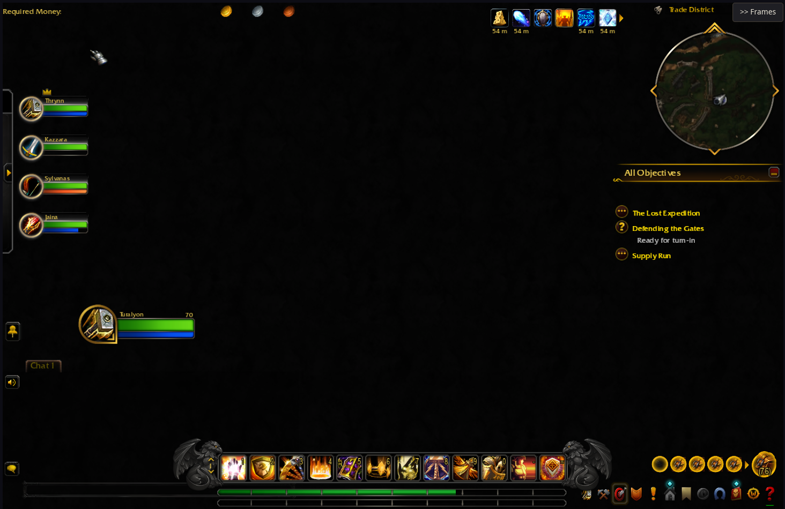 | 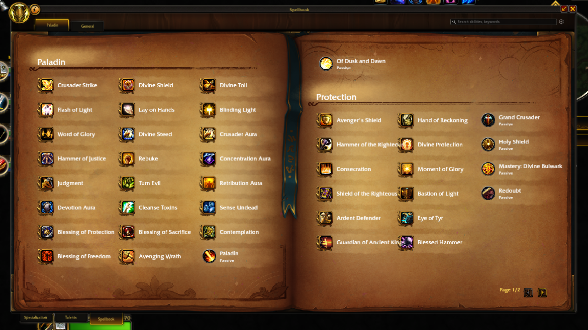 |

| Character Panel | Reputations Panel |
|---|---|
| 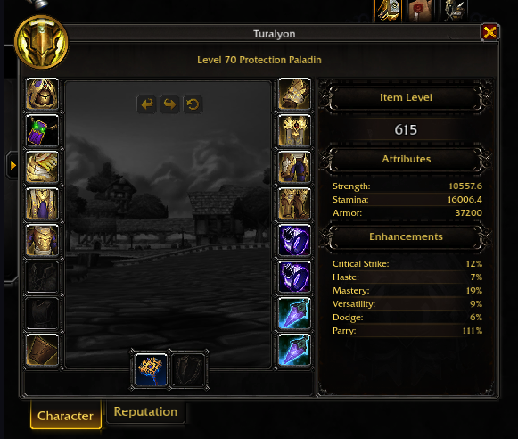 | 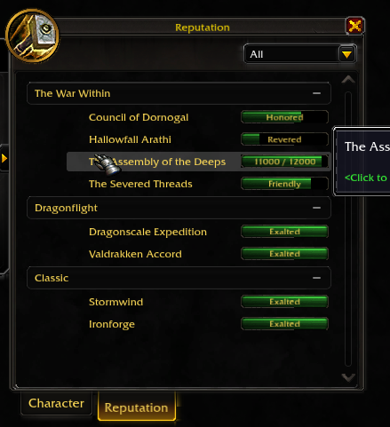 |

| Blacksmithing | Guild Panel |
|---|---|
| 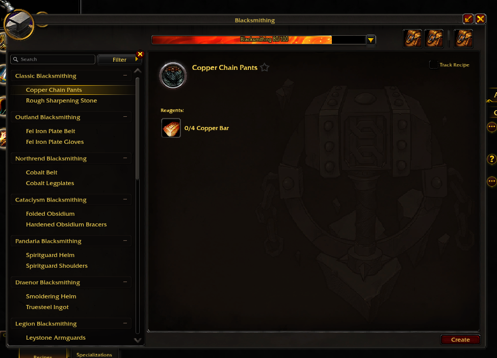 | 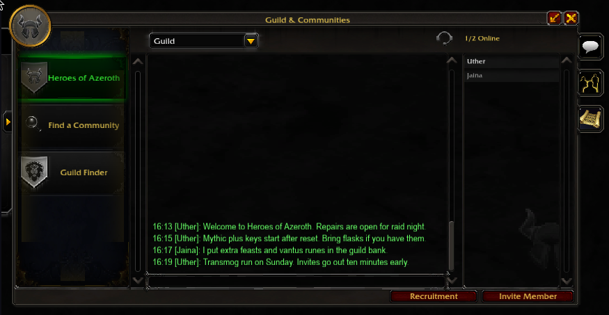 |

| Store | Achievements Panel |
|---|---|
| 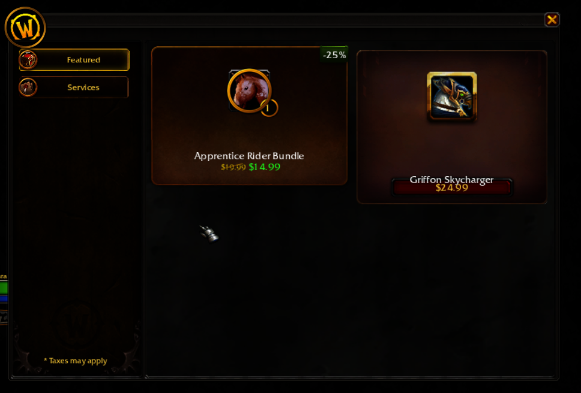 | 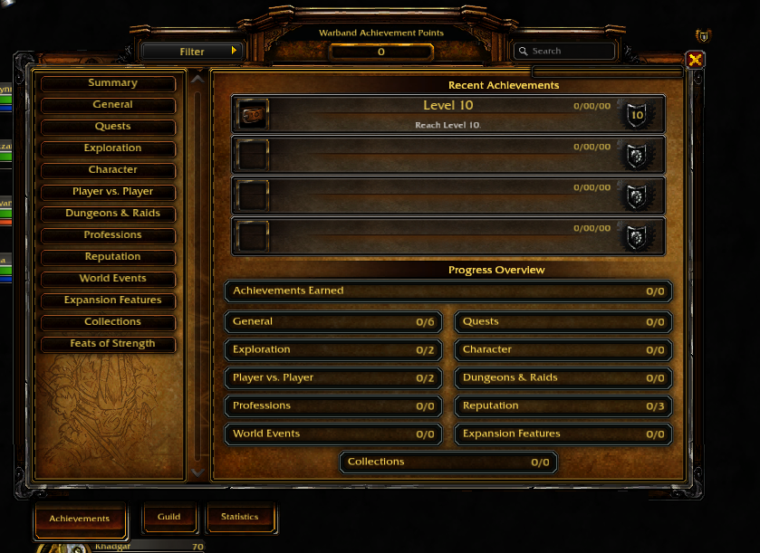 |

| World Map | Housing Panel |
|---|---|
| 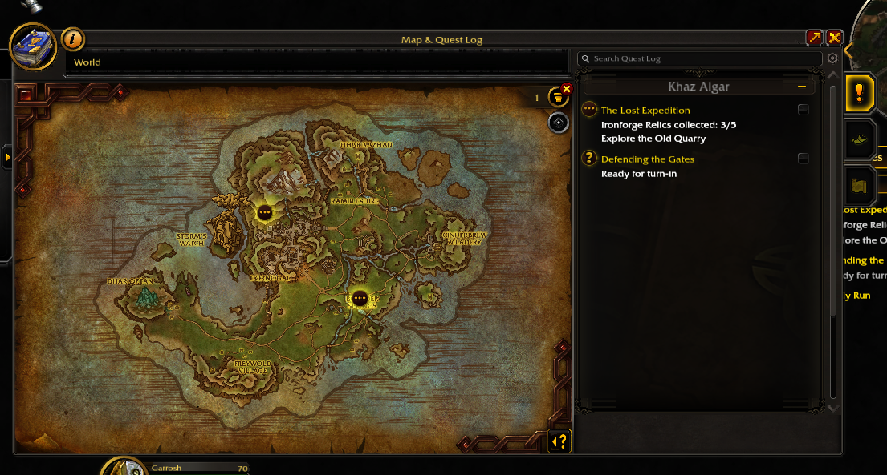 | 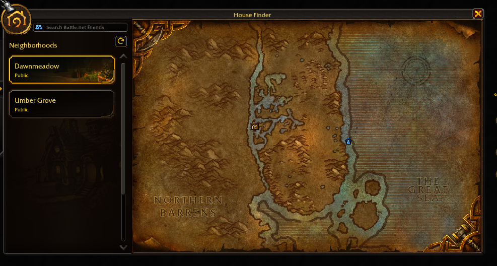 |

| Damage Meter |
|---|
| 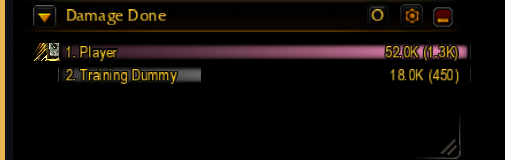 |

## GitHub Action

Run your addon's test suite in CI:

```yaml
- uses: osso/wow-ui-sim@v1
  with:
    addon: MyAddon
```

Tests live in `Interface/AddOns/MyAddon/tests/*.lua`:

```lua
test("frame name matches", function()
    local f = CreateFrame("Frame", "MyFrame")
    assertEquals("MyFrame", f:GetName())
end)
```

## Docker

```bash
# Run addon tests
docker run --rm \
  -v ./MyAddon:/app/Interface/AddOns/MyAddon \
  ghcr.io/osso/wow-ui-sim run-tests MyAddon

# Run with all Blizzard addons loaded
docker run --rm \
  -v ./MyAddon:/app/Interface/AddOns/MyAddon \
  ghcr.io/osso/wow-ui-sim --no-saved-vars run-tests MyAddon
```

## Writing Tests

Test files go in `tests/` under your addon directory. Available assertions:

| Function | Description |
|---|---|
| `assertEquals(expected, actual)` | Strict equality |
| `assertNotEquals(expected, actual)` | Not equal |
| `assertTrue(value)` / `assertFalse(value)` | Truthy/falsy |
| `assertNil(value)` / `assertNotNil(value)` | Nil checks |
| `assertError(fn)` | Function throws an error |
| `assertType(expected, value)` | `type(value) == expected` |
| `assertAlmostEquals(expected, actual, tolerance?)` | Float comparison (default 0.001) |
| `assertContains(haystack, needle)` | String substring or table value |
| `assertStartsWith(str, prefix)` | String prefix |
| `assertEndsWith(str, suffix)` | String suffix |
| `assertMatches(str, pattern)` | Lua pattern match |
| `assertCount(expected, table)` | Table element count |
| `assertTableEquals(expected, actual)` | Deep table equality |
| `assertTableContains(table, subset)` | Table contains subset (deep) |

Async tests for timers and callbacks:

```lua
async_test("timer fires callback", function(done)
    C_Timer.After(0, function()
        done(function()
            assertTrue(true)
        end)
    end)
end)
```

## License

GPL-3.0-only
